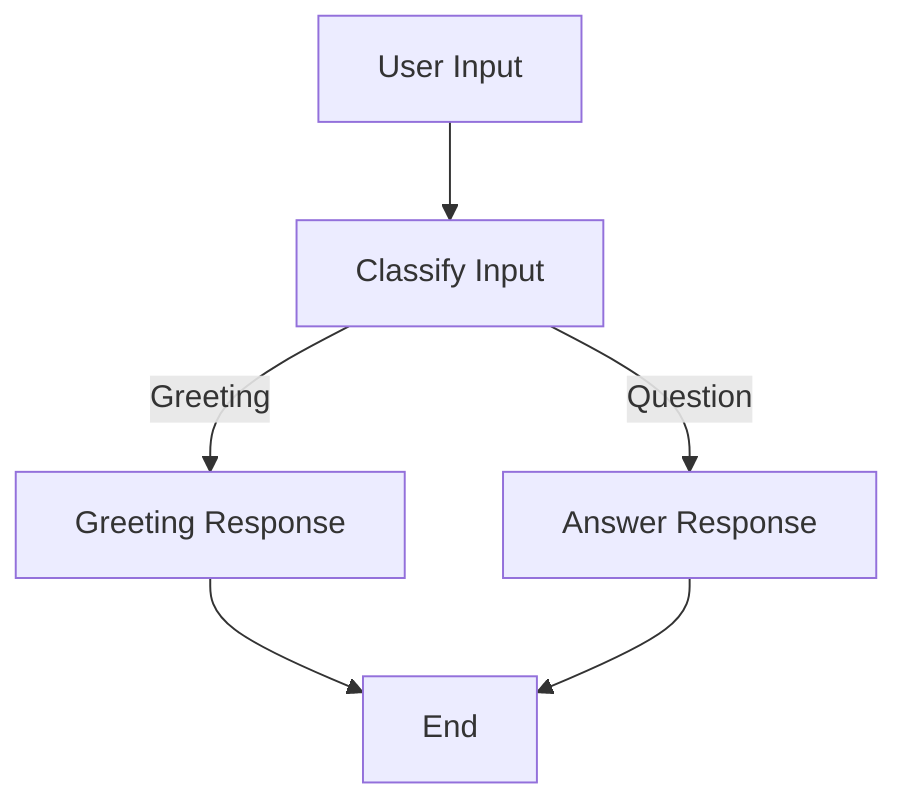
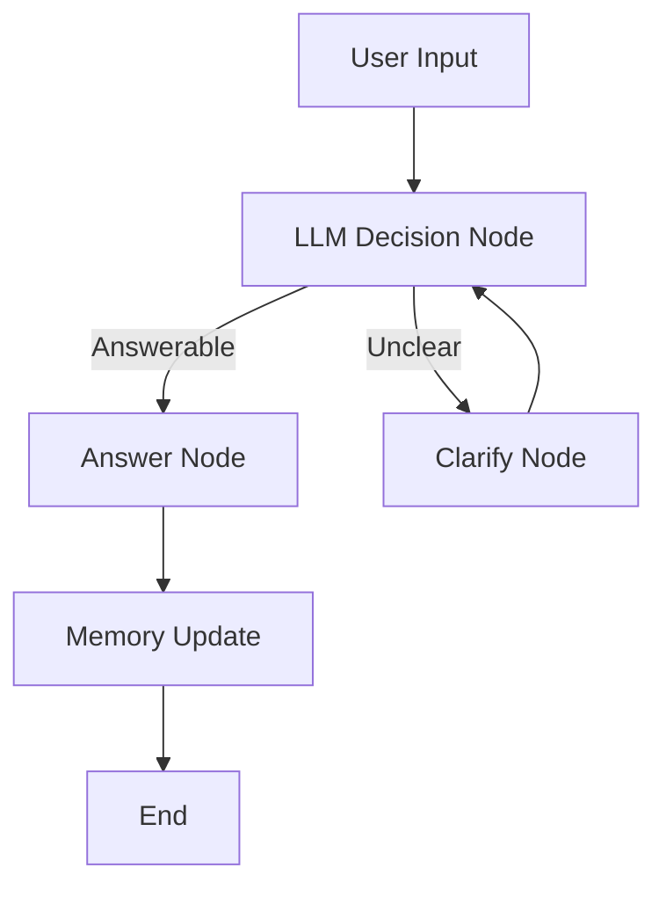
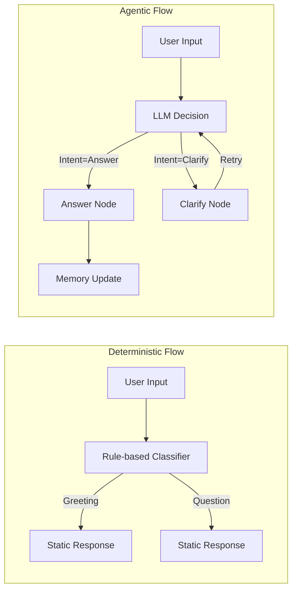

# 🧠 From Deterministic Pipelines to Agentic LangGraph Workflows

This guide explores **two distinct approaches** to designing AI workflows:
1. **Deterministic (Rule-based)** — predefined control flow  
2. **Agentic / Dynamic (LLM-driven)** — adaptive reasoning and memory-driven logic  

It demonstrates how LangGraph moves us from rigid pipelines to flexible, intelligent agents that can reason, remember, and recover from errors.

---

## 🚀 Why This Matters

Traditional AI pipelines often rely on **hard-coded logic**:
> “If input = X → run function Y → return Z.”

But as LLMs evolve, they can:
- Decide dynamically what action to take next  
- Adapt based on user intent or context  
- Maintain memory across turns  
- Handle errors gracefully  

That’s where **LangGraph** shines — combining **graph structure** with **agentic reasoning**.

---

## 🧭 Two Approaches to AI Workflow Design

| Aspect | Deterministic (Rule-based) | Agentic (Dynamic / LLM-driven) |
|:--|:--|:--|
| **Flow Type** | Fixed and linear | Dynamic and adaptive |
| **Decision Logic** | Rules or if-else conditions | LLM-based reasoning |
| **State / Memory** | Stateless | Persistent (via graph memory) |
| **Error Handling** | Manual, via exceptions | Built-in retry edges |
| **Use Case Example** | Simple classification, FAQ bots | AI assistants, autonomous agents |
| **LangGraph Advantage** | Easy to reason about | Capable of multi-turn reasoning and adaptability |

---

## 🧩 Approach 1 — Deterministic Flow (Rule-based)

A **predictable**, rule-based workflow that uses conditional routing.  
Useful when logic is predefined — e.g., classifying user intent into known categories.

### 🧠 Flow Diagram

### 🧰 Example: Build Your First Graph with Conditional Routing
``` python
from langgraph.graph import StateGraph, END

def classify_input(state):
    text = state["input"].lower()
    if "hello" in text or "hi" in text:
        return {"intent": "greeting"}
    else:
        return {"intent": "question"}

def handle_greeting(state):
    return {"output": "Hello! How can I assist you today?"}

def handle_question(state):
    return {"output": "That's a great question — let me find out!"}

# Define Graph
graph = StateGraph(dict)

graph.add_node("classify", classify_input)
graph.add_node("greeting", handle_greeting)
graph.add_node("question", handle_question)

graph.add_conditional_edges(
    "classify",
    lambda state: state["intent"],
    {
        "greeting": "greeting",
        "question": "question"
    }
)

graph.add_edge("greeting", END)
graph.add_edge("question", END)
graph.set_entry_point("classify")

app = graph.compile()
result = app.invoke({"input": "hi there!"})
print(result["output"])

```
### ✅ Output:
``` css

Hello! How can I assist you today?
```

---

## 🧬 Approach 2 — Agentic Flow (LLM-driven with Memory & Retry)

A **dynamic** graph where the LLM decides what to do next, stores memory, and retries failed steps.
Ideal for **multi-turn**, reasoning-heavy AI agents.

### 🧠 Flow Diagram

### 🧰 Example: Adding Memory and Retry Edges
``` python
from langgraph.graph import StateGraph, END
from langgraph.checkpoint.memory import MemorySaver
from langchain_openai import ChatOpenAI

llm = ChatOpenAI(model="gpt-4o-mini")
memory = MemorySaver()

def analyze_intent(state):
    text = state["input"]
    intent = "clarify" if "?" not in text else "answer"
    return {"intent": intent, "history": state.get("history", []) + [text]}

def answer_node(state):
    response = llm.invoke(f"Answer the question: {state['input']}")
    return {"output": response, "history": state["history"]}

def clarify_node(state):
    return {"output": "Can you please clarify your question?", "retry": True}

# Build Graph
graph = StateGraph(dict)

graph.add_node("analyze", analyze_intent)
graph.add_node("answer", answer_node)
graph.add_node("clarify", clarify_node)

graph.add_conditional_edges(
    "analyze",
    lambda s: s["intent"],
    {"answer": "answer", "clarify": "clarify"}
)

# Retry edge
graph.add_edge("clarify", "analyze")

graph.add_edge("answer", END)
graph.set_entry_point("analyze")

app = graph.compile(checkpointer=memory)
result = app.invoke({"input": "What's LangGraph?"})
print(result["output"])

```
### ✅ Output:
``` csharp

LangGraph is a framework that lets you design LLM-driven workflows using graph structures.

```

## 🧩 Visual Summary


---
## 🧩 Key Takeaways
- **Start deterministic**, when logic is predictable.
- **Evolve to agentic**, when your workflow needs flexibility and reasoning.
- LangGraph gives you the **best of both worlds**: a structured yet intelligent flow.

---
## 🧠 Next Steps
- Experiment by adding **tool calling** and **parallel branches**.
- Store graph checkpoints in a **Redis** or **MongoDB** backend for multi-session memory.
- Integrate this with **Streamlit** or **FastAPI** for interactive agents
---
