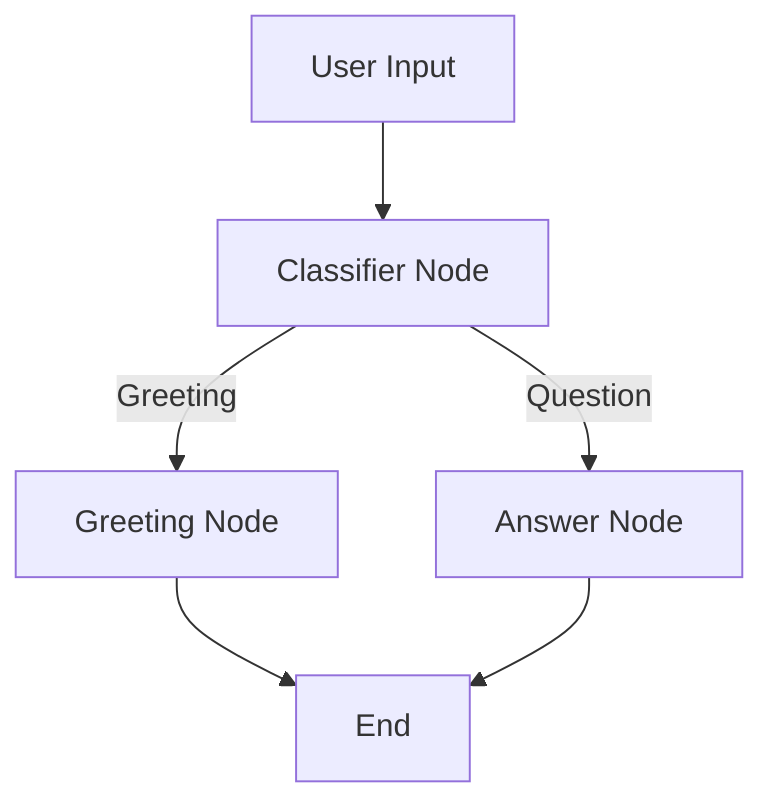
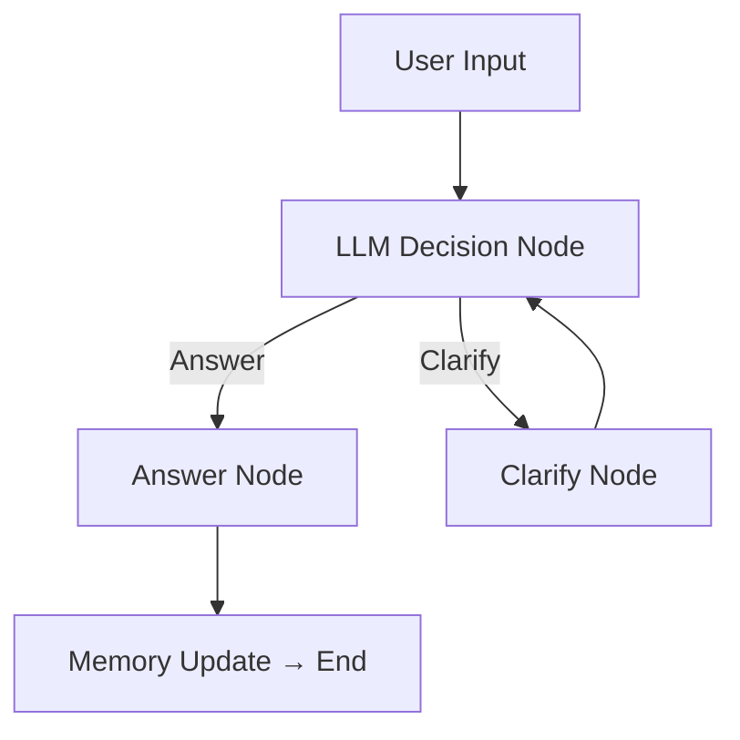
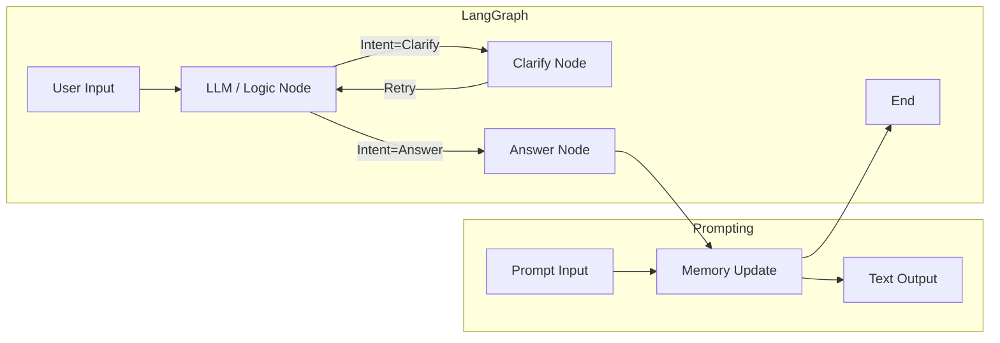

# 🧠 From Prompting to LangGraph  
*A Developer’s Guide to Moving from Naive Prompts to Structured AI Workflows*

---

## 🚀 Why This Guide

Most developers start their LLM journey with **prompt-based experiments**:
> “I’ll just ask the model what I want.”

That works — until you need:
- Consistent, testable, **repeatable** behavior  
- Multi-step logic or conditional reasoning  
- Error handling and recovery  
- Persistent **state** or **memory**  
- Integration with external APIs and tools  

**LangGraph** bridges this gap — bringing structure to the creativity of LLMs.

This guide walks you through that evolution step by step.

---

## 🧭 Two Mindsets in AI Workflow Design

| Aspect | Prompting Approach | LangGraph Approach |
|:--|:--|:--|
| **Control Flow** | One-shot LLM call | Multi-node state graph |
| **Logic** | Hidden in text prompt | Explicit, programmable edges |
| **Memory** | Manual, via context | Built-in persistence |
| **Error Handling** | Retry manually | Defined retry edges |
| **Scaling** | Hard to debug | Structured, modular graphs |
| **Best For** | Quick experiments | Production-ready AI systems |

---

## 💬 Example 1 — The “Prompting First Instinct”

A typical developer starts here 👇

```python
from openai import OpenAI
client = OpenAI()

prompt = """
You are a helpful assistant. Classify the user message as GREETING or QUESTION.
Message: "Hi, can you help me?"
"""

response = client.chat.completions.create(
    model="gpt-4o-mini",
    messages=[{"role": "user", "content": prompt}]
)

print(response.choices[0].message.content)
```

### ✅ Works fine, but:
- No explicit control flow
- Hard to debug or maintain
- No memory
- If you need to take actions based on the result, you’re stuck with string parsing

---

## 🔁 Example 2 — Structured with LangGraph

Now let’s translate the same logic into a **deterministic graph** using LangGraph.

### 🧩 Diagram

### 🧠 Code: Build Your First Graph
``` python
from langgraph.graph import StateGraph, END

def classify_input(state):
    text = state["input"].lower()
    if "hi" in text or "hello" in text:
        return {"intent": "greeting"}
    return {"intent": "question"}

def greeting_node(state):
    return {"output": "Hello! How can I assist you today?"}

def answer_node(state):
    return {"output": "That's a good question — let me help with that."}

graph = StateGraph(dict)
graph.add_node("classify", classify_input)
graph.add_node("greeting", greeting_node)
graph.add_node("answer", answer_node)

graph.add_conditional_edges(
    "classify",
    lambda s: s["intent"],
    {"greeting": "greeting", "question": "answer"}
)
graph.add_edge("greeting", END)
graph.add_edge("answer", END)
graph.set_entry_point("classify")

app = graph.compile()
result = app.invoke({"input": "Hi, can you help?"})
print(result["output"])

```
### ✅ Output:
```

Hello! How can I assist you today?
```

### 🧩 Why It’s Better
- Explicit logic (intent → node)
- Extensible — you can add more nodes for other behaviors
- Fully testable and debuggableparsing

---

## 🧬 Example 3 — From Deterministic to Agentic F

Let’s take it a step further:
The model now **decides dynamically** how to respond and stores **conversation memory**.

### 🧩 Diagram

### 🧠 Code: Add LLM Reasoning, Memory, and Retry
``` python
from langgraph.graph import StateGraph, END
from langgraph.checkpoint.memory import MemorySaver
from langchain_openai import ChatOpenAI

llm = ChatOpenAI(model="gpt-4o-mini")
memory = MemorySaver()

def analyze_intent(state):
    text = state["input"]
    # Model decides intent
    intent = "clarify" if "?" not in text else "answer"
    history = state.get("history", [])
    history.append(text)
    return {"intent": intent, "history": history}

def answer_node(state):
    response = llm.invoke(f"Answer the question: {state['input']}")
    return {"output": response, "history": state["history"]}

def clarify_node(state):
    return {"output": "Could you clarify your question?", "retry": True}

graph = StateGraph(dict)
graph.add_node("analyze", analyze_intent)
graph.add_node("answer", answer_node)
graph.add_node("clarify", clarify_node)

graph.add_conditional_edges(
    "analyze",
    lambda s: s["intent"],
    {"answer": "answer", "clarify": "clarify"}
)
graph.add_edge("clarify", "analyze")  # Retry
graph.add_edge("answer", END)
graph.set_entry_point("analyze")

app = graph.compile(checkpointer=memory)
result = app.invoke({"input": "What's LangGraph?"})
print(result["output"])

```
### ✅ Output:
``` 
LangGraph is a framework that helps design structured, stateful LLM workflows.

```

### 🔍 What’s New
- Dynamic intent selection (LLM-driven)
- Persistent memory with MemorySaver
- Retry logic via edges
- Fully agentic behavior

---

## 🧩 Prompt vs. LangGraph — Side-by-Side

| Feature                  | Prompting                 | LangGraph                    |
| :----------------------- | :------------------------ | :--------------------------- |
| **Execution**            | Single LLM call           | Node-by-node graph traversal |
| **Error Recovery**       | Manual                    | Retry edges                  |
| **State / Memory**       | Pass context manually     | Built-in checkpointing       |
| **Scalability**          | Not composable            | Modular graphs               |
| **Observability**        | Hidden chain of reasoning | Transparent node logs        |
| **Production Readiness** | Prototype only            | Production-grade             |

---

## 🧩 Prompt vs. LangGraph — Side-by-Side


### 💡 Key Takeaways
1. **Prompting is great for exploration** — but not for scaling.
2. **LangGraph** provides explicit control flow, state management, and recovery.
3. **You can start deterministic**, and evolve into **agentic systems**.
4. Developers can now build **reliable AI workflows** that think and follow rules.

---

### 🧰 Next Steps for Developers
- Add **tools** (e.g., search APIs, calculators) via LangChain integrations.
- Use **graph memory persistence** (Redis, MongoDB, SQLite).
- Wrap graphs in **FastAPI** or **Streamlit** for end-user apps.
- Explore **interrupts and guardrails** to balance control with creativity.

---

## ✨ Author

Developed for the **Developer Community** by [EXPESRaza](https://github.com/EXPESRaza).  
Inspired by real-world prompt-to-graph evolution journey.

---
